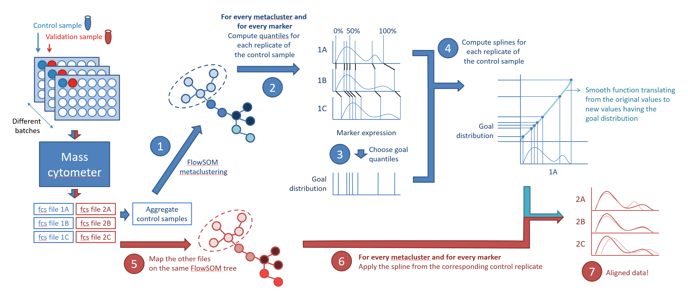

# CytoNorm
R library to normalize cytometry data.  
! From version 2 onwards, the default number of quantiles is 99; the 0th and 100th quantile are not included anymore.

## Installation

This R library can be installed by running the following lines:

```{r}
library(devtools)
install_github('saeyslab/CytoNorm')
```

## Main idea


To normalize the data between multiple batches, we recommend taking a control sample along across all batches.
The algorithm is run in two steps. First the model gets trained (blue part), by clustering the cells in their main cell types (using the FlowSOM algorithm), determining the quantiles for each marker for each cluster, and finally learning a spline to transfer from the computed quantiles to goal quantiles (either values averaged across all files, values from one specific batch or manually entered values). Then it can be applied to the samples of interest (red part). These (potentially new) files will be mapped to the FlowSOM clustering, and than the relevant spline for every marker and every cluster will be applied. New fcs files will be created with adapted values. If a validation sample is taken along, it can be used to check if the values after normalization line up correctly.

Note that we assume that the first clustering step will not be impacted by the batch effects. This can be tested by computing the CV values for the clusters. If this assumption does not hold, you can use the quantile normalization without clustering instead. In this case, cell type specific artefacts might be missed.

## Usage
The default workflow is explained below. However, vignettes are available for special use cases.
- [Run CytoNorm without controls](vignettes/CytoNorm_without_controls.md):`vignette(CytoNorm_without_controls", package="CytoNorm")
- [Run CytoNorm towards distribution](vignettes/CytoNorm_towards_distribution.md):`vignette(CytoNorm_towards_distribution", package="CytoNorm")
- [Run CytoNorm on channels without using them for the clustering](vignettes/CytoNorm_channels_without_clustering.md):`vignette(CytoNorm_channels_without_clustering", package="CytoNorm")

### Identifying the data

The example dataset included in the package consists of 6 samples coming from 3 different batches. Each sample contains only the first 1000 cells of the original samples to limit library size. The original files can be downloaded from flowRepository dataset FR-FCM-Z247.

Samples from Volunteer 1 from each batch will be used as the control sample, while the samples from Volunteer 2 will be used as a validation sample. This part of the code should be adapted to your own data as needed.

```{r}
dir <- system.file("extdata", package = "CytoNorm")
files <- list.files(dir, pattern = "fcs$")
data <- data.frame(File = files,
                   Path = file.path(dir, files),
                   Type = stringr::str_match(files, "_([12]).fcs")[, 2],
                   Batch = stringr::str_match(files, "PTLG[0-9]*")[, 1],
                   stringsAsFactors = FALSE)
data$Type <- c("1" = "Train", "2" = "Validation")[data$Type]

train_data <- dplyr::filter(data, Type == "Train")
validation_data <- dplyr::filter(data, Type == "Validation")

ff <- flowCore::read.FCS(data$Path[1])
channels <- flowCore::colnames(ff)[c(48, 46, 43, 45, 20, 16, 21, 19, 22, 50, 47,
                                     40, 44, 33, 17, 11, 18, 51, 14, 23, 32, 10,
                                     49, 27, 24, 31, 42, 37, 39, 34, 41, 26, 30, 
                                     28, 29, 25, 35)]
transformList <- flowCore::transformList(channels,
                                         cytofTransform)
transformList.reverse <- flowCore::transformList(channels,
                                                 cytofTransform.reverse)
```

### Testing whether clustering is appropriate

We build a FlowSOM model and compute the CV values for different cluster numbers to evaluate the appropriateness of the clustering. You might need to lower the number of clusters or skip the clustering step altogether if the clusters are impacted by the batch effects (e.g. if CV values higher than 1.5 or 2 are occuring).

```{r}
fsom <- prepareFlowSOM(train_data$Path,
                       channels,
                       nCells = 6000,
                       FlowSOM.params = list(xdim = 5,
                                             ydim = 5,
                                             nClus = 10,
                                             scale = FALSE),
                       transformList = transformList,
                       seed = 1)
                       
cvs <- testCV(fsom,
              cluster_values = c(5, 10, 15)) 
              
cvs$pctgs$`10`
```

### Training the model

```{r}
model <- CytoNorm.train(files = train_data$Path,
                        labels = train_data$Batch,
                        channels = channels,
                        transformList = transformList,
                        FlowSOM.params = list(nCells = 6000, 
                                              xdim = 5,
                                              ydim = 5,
                                              nClus = 10,
                                              scale = FALSE),
                        normMethod.train = QuantileNorm.train,
                        normParams = list(nQ = 101,
                                          goal = "mean"),
                        seed = 1,
                        verbose = TRUE)
```

FlowSOM.params can include several arguments passed to the FlowSOM function, next to "nCells", the total number of cells to subsample from the aggregated flowframe of all training data, and "channels", if the channels to compute FlowSOM on should be different than the channels chosen for normalization.

normParams takes "nQ", the number of quantiles. Additionally, quantile_values
The goal can be "mean", one of the batch labels, or nQ numbers (e.g. nQ = 2, )

### Normalizing data

```{r}
CytoNorm.normalize(model = model,
                   files = validation_data$Path,
                   labels = validation_data$Batch,
                   transformList = transformList,
                   transformList.reverse = transformList.reverse,
                   normMethod.normalize = QuantileNorm.normalize,
                   outputDir = "Normalized",
                   prefix = "Norm_",
                   clean = TRUE,
                   verbose = TRUE)
```

## References
Van Gassen et al. CytoNorm: A Normalization Algorithm for Cytometry Data
Cytometry. Cytometry A 97, 268-228 (2020). <doi:10.1002/cyto.a.23904>
